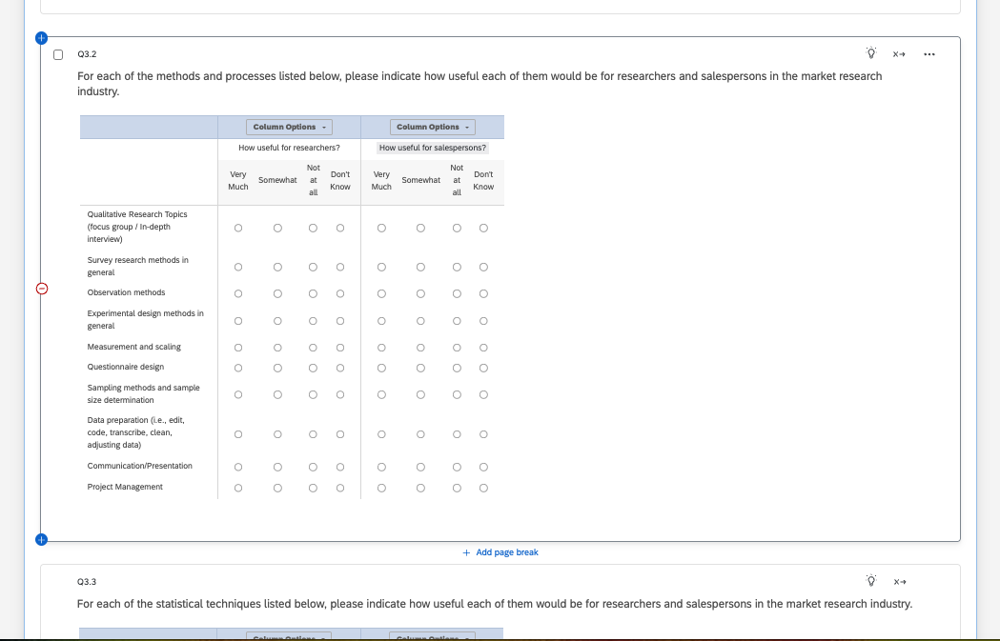
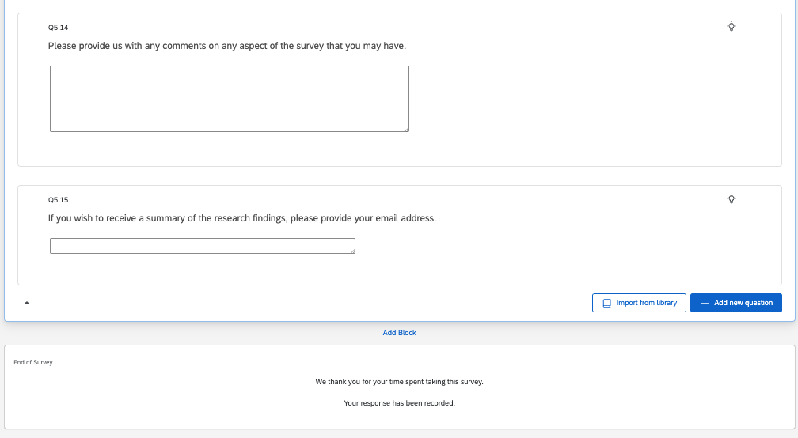

# Screenshots

## Proof of Sharing

The following screenshot is proof that I shared my final survey draft with Dr. Jung and gave him all the permissions.

{fig-align="center"}

## Full Survey with All Sections Collapsed

This screenshot shows all 5 sections of my survey correctly labeled and with the right number of questions.

{fig-align="center"}

## Beginning, Middle, and End

These screenshots show the questions at the beginning, middle, and end of my survey, pasted and reformatted from Dr. Jung's `Jung_Jae_-_Survey_of_Educational_Needs_for_MR_Professionals` Word file.

{fig-align="center"}

{fig-align="center"}

{fig-align="center"}

# Appendix and Conclusion

I have had quite a bit of experience with Qualtrics in the past, so this assignment was relatively straightforward for me.
