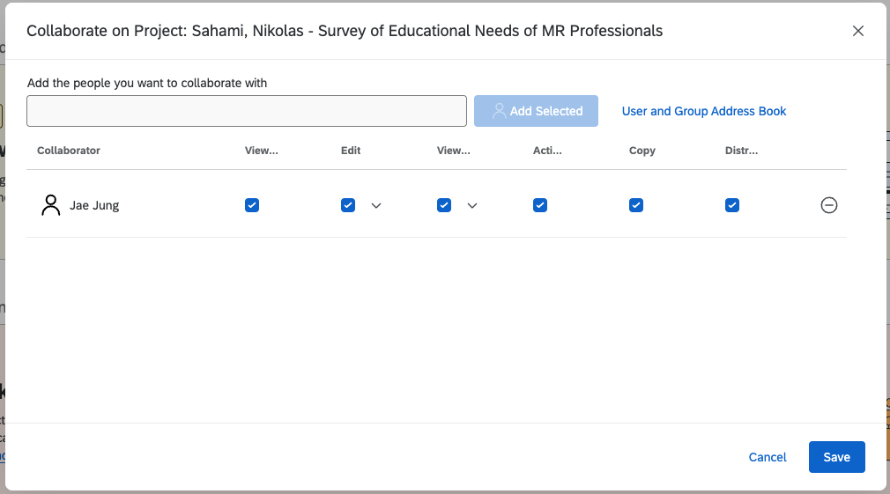
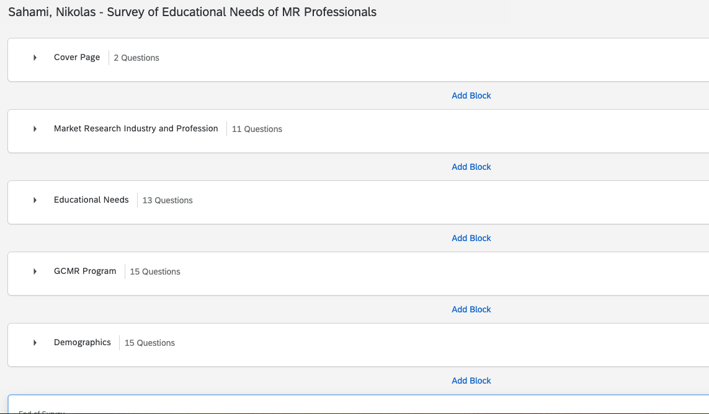
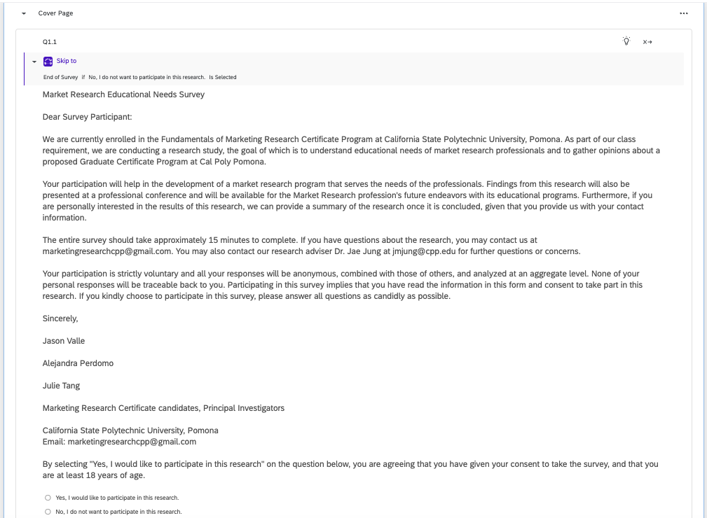

# Screenshots

## Proof of Sharing

The following screenshot is proof that I shared my final survey draft with Dr. Jung and gave him all the permissions.

{fig-align="center"}

## Full Survey with All Sections Collapsed

This screenshot shows all 5 sections of my survey correctly labeled and with the right number of questions.

{fig-align="center"}

## Beginning, Middle, and End

These screenshots show the questions at the beginning, middle, and end of my survey, pasted and reformatted from Dr. Jung's `Jung_Jae_-_Survey_of_Educational_Needs_for_MR_Professionals` Word file.

{fig-align="center"}

{fig-align="center"}

{fig-align="center"}

# Appendix and Conclusion

I have had quite a bit of experience with Qualtrics in the past, so this assignment was relatively straightforward for me. I had not used the recoding values options or the *Side by Side* question format before, so I liked being able to use some new features. I have experience with the standard block layouts and question formats, so the most tedious part for me was pasting each question from the `Jung_Jae_-_Survey_of_Educational_Needs_for_MR_Professionals.docx` file into Qualtrics.

I also had some issues with my original Qualtrics survey not previewing the way I wanted it to, so I tried to consult the Qualtrics help page and ask ChatGPT about it, but I ended up just making a copy of it and deleting the original, and this seemed to work fine. This was probably the biggest challenge I faced when working on this assignment, but I think I have everything working correctly now.

## GitHub Repo Link

<https://github.com/itsnik1/m01_qualtrics/tree/main>

## GH Pages Link

<https://itsnik1.github.io/m01_qualtrics/>
